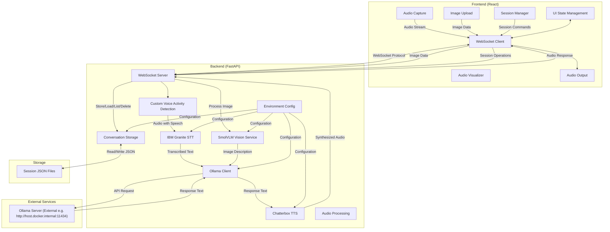
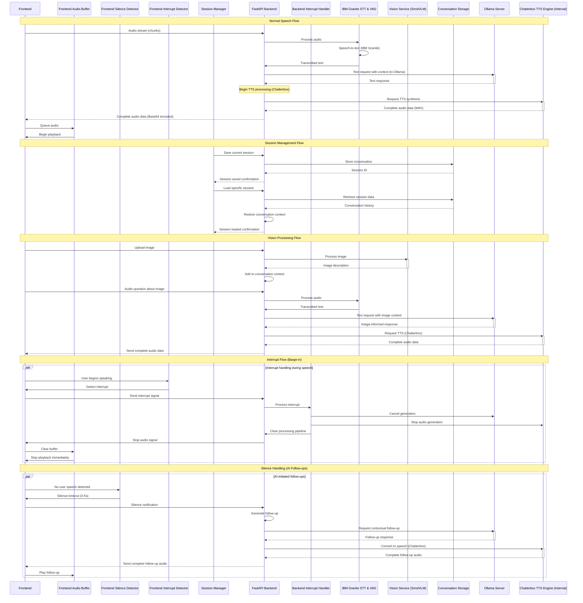

# Vocalis

[](https://opensource.org/licenses/Apache-2.0)
[](https://reactjs.org/)
[](https://fastapi.tiangolo.com/)
[](https://huggingface.co/docs/transformers/index)
[](https://ollama.com/)
[](https://pypi.org/project/pyttsx3/)
[](https://www.python.org/)
[](https://www.docker.com/)

A sophisticated AI assistant with speech-to-speech capabilities built on a modern React frontend and a FastAPI backend. Vocalis utilizes **IBM Granite** for Speech-to-Text, **Ollama** for Large Language Model interactions, and **pyttsx3 (Chatterbox)** for Text-to-Speech, all containerized with Docker for easy deployment. It provides a responsive, low-latency conversational experience with advanced visual feedback.

## Video Demonstration of Setup and Usage

[](https://www.youtube.com/watch?v=2slWwsHTNIA)

## Changelog

**v1.5.0** (Vision Update) - April 12, 2025
- 🔍 New image analysis capability powered by [SmolVLM-256M-Instruct model](https://huggingface.co/HuggingFaceTB/SmolVLM-256M-Instruct)
- 🖼️ Seamless image upload and processing interface
- 🔄 Contextual conversation continuation based on image understanding
- 🧩 Multi-modal conversation support (text, speech, and images)
- 💾 Advanced session management for saving and retrieving conversations
- 🎨 Improved UI with central call button and cleaner control layout
- 🔌 Simplified sidebar without redundant controls

**v1.0.0** (Initial Release) - March 31, 2025
- ✨ Revolutionary barge-in technology for natural conversation flow
- 🔊 Ultra low-latency audio streaming with adaptive buffering
- 🤖 AI-initiated greetings and follow-ups for natural conversations
- 🎨 Dynamic visual feedback system with state-aware animations
- 🔄 Streaming TTS with chunk-based delivery for immediate responses
- 🚀 Cross-platform support with optimised setup scripts
- 💻 CUDA acceleration with fallback for CPU-only systems

## Features

### 🎯 Advanced Conversation Capabilities

- **🗣️ Barge-In Interruption** - Interrupt the AI mid-speech for a truly natural conversation experience
- **👋 AI-Initiated Greetings** - Assistant automatically welcomes users with a contextual greeting
- **💬 Intelligent Follow-Ups** - System detects silence and continues conversation with natural follow-up questions
- **🔄 Conversation Memory** - Maintains context throughout the conversation session
- **🧠 Contextual Understanding** - Processes conversation history for coherent, relevant responses
- **🖼️ Image Analysis** - Upload and discuss images with integrated visual understanding
- **💾 Session Management** - Save, load, and manage conversation sessions with customisable titles

### ⚡ Ultra-Responsive Performance

- **⏱️ Low-Latency Processing** - End-to-end latency under 500ms for immediate response perception
- **🔊 Streaming Audio** - Begin playback before full response is generated
- **📦 Adaptive Buffering** - Dynamically adjust audio buffer size based on network conditions
- **🔌 Efficient WebSocket Protocol** - Bidirectional real-time audio streaming
- **🔄 Parallel Processing** - Multi-stage pipeline for concurrent audio handling

### 🎨 Interactive Visual Experience

- **🔮 Dynamic Assistant Orb** - Visual representation with state-aware animations:
  - Pulsing glow during listening
  - Particle animations during processing
  - Wave-like motion during speaking
- **📝 Live Transcription** - Real-time display of recognised speech
- **🚦 Status Indicators** - Clear visual cues for system state
- **🌈 Smooth Transitions** - Fluid state changes with appealing animations
- **🌙 Dark Theme** - Eye-friendly interface with cosmic aesthetic

### 🛠️ Technical Excellence

- **🔍 High-Accuracy VAD** - Superior voice activity detection using custom-built VAD
- **🗣️ Advanced STT Integration** - IBM Granite for accurate transcription via Hugging Face Transformers.
- **🧠 Flexible LLM Integration** - Connects to external Ollama server for powerful language processing.
- **🔊 High-Quality TTS Engine** - Resemble AI's Chatterbox for state-of-the-art Text-to-Speech synthesis.
- **🐳 Dockerized Backend** - Complete Docker setup for easy deployment and consistent environments.
- **🖥️ Hardware Flexibility** - CUDA acceleration for STT and TTS models (where applicable) with CPU fallback.
- **🔧 Easy Configuration** - Environment variables for all key settings.

## Quick Start

### Prerequisites for Manual Setup

#### Windows
- Python 3.10+ installed and in your PATH
- Node.js and npm installed

#### macOS
- Python 3.10+ installed
- Install Homebrew (if not already installed):
  ```bash
  /bin/bash -c "$(curl -fsSL https://raw.githubusercontent.com/Homebrew/install/HEAD/install.sh)"
  ```
- Install Node.js and npm:
  ```bash
  brew install node
  ```
- **Apple Silicon (M1/M2/M3/M4) Notes**:
  - The setup will automatically install a compatible PyTorch version
  - If you encounter any PyTorch-related errors, you may need to manually install it:
    ```bash
    pip install torch
    ```
    Then continue with the regular setup.

### One-Click Setup (Recommended)

#### Windows
1. Run `setup.bat` to initialise the project (one-time setup)
   - Includes option for CUDA or CPU-only PyTorch installation
2. Run `run.bat` to start both frontend and backend servers
3. If you need to update dependencies later, use `install-deps.bat`

#### macOS/Linux
1. Make scripts executable: `chmod +x *.sh`
2. Run `./setup.sh` to initialise the project (one-time setup)
   - Includes option for CUDA or CPU-only PyTorch installation
3. Run `./run.sh` to start both frontend and backend servers
4. If you need to update dependencies later, use `./install-deps.sh`

### Manual Setup (Alternative)

If you prefer to set up the project manually, follow these steps:

#### Backend Setup
1. Create a Python virtual environment:
   ```bash
   cd backend
   python -m venv env
   # Windows:
   .\env\Scripts\activate
   # macOS/Linux:
   source env/bin/activate
   ```

2. Install the Python dependencies:
   ```bash
   pip install -r requirements.txt
   ```

3. If you need CUDA support, install PyTorch with CUDA:
   ```bash
   pip install torch torchvision torchaudio --index-url https://download.pytorch.org/whl/cu124
   ```

4. Start the backend server:
   ```bash
   python -m backend.main
   ```
   - Ensure your `backend/.env` file is configured with `OLLAMA_HOST` pointing to your Ollama server, and other settings like `STT_MODEL_NAME`, `TTS_ENGINE_RATE`, and `TTS_ENGINE_VOICE_ID` are reviewed. (Note: `VOCALIS_API_KEY` previously mentioned for REST endpoints is no longer used for them as they are now unauthenticated for local use).

#### Frontend Setup
The frontend setup remains the same. It will connect to the backend (either manual or Dockerized) on `ws://localhost:8000/ws`.
1. Install Node.js dependencies:
   ```bash
   cd frontend
   npm install
   ```

2. Start the development server:
   ```bash
   npm run dev
   ```

### Running with Docker (Recommended for Backend)

This is the recommended way to run the Vocalis backend for a consistent environment.

**Prerequisites:**
- Docker installed and running.
- Docker Compose installed.
- An Ollama server running and accessible from your Docker environment (e.g., on `http://localhost:11434` on your host machine).
- **NVIDIA Container Toolkit** installed on the host system if GPU acceleration for STT (e.g., with IBM Granite) is desired. The `Dockerfile` is configured to use a CUDA-enabled base image, and `docker-compose.yml` requests GPU resources.

**Steps:**
1.  **Configure Ollama Connection:**
    The `docker-compose.yml` is pre-configured to connect to Ollama at `http://host.docker.internal:11434`. This works for Docker Desktop (Mac/Windows).
    -   **Linux Users:** If `host.docker.internal` doesn't work, you may need to:
        -   Find your host's IP on the `docker0` bridge (e.g., `ip addr show docker0`) and use that IP in the `OLLAMA_HOST` environment variable within `docker-compose.yml`.
        -   Or, modify `docker-compose.yml` to run Ollama as another service and use Docker networking.
    -   You can also set `OLLAMA_HOST` in a `.env` file in the project root, and `docker-compose` can pick it up (see comments in `docker-compose.yml`).

2.  **Build and Run:**
    Navigate to the project root directory (where `docker-compose.yml` is located) and run:
    ```bash
    docker-compose up --build -d
    ```
    The `-d` flag runs the containers in detached mode.

3.  **Backend Access:**
    The backend will be accessible at `http://localhost:8000`. The WebSocket endpoint will be `ws://localhost:8000/ws`.

4.  **Viewing Logs:**
    ```bash
    docker-compose logs -f vocalis-backend
    ```

5.  **Stopping:**
    ```bash
    docker-compose down
    ```

### Personalising Vocalis

After launching Vocalis, you can customise your experience through the sidebar:

1. Click the sidebar icon to open the navigation panel
2. Under the "Settings" tab, click "Preferences" to access personalisation options

The preferences modal offers several ways to tailor Vocalis to your needs:

#### User Profile
- **Your Name**: Enter your name to personalise greetings and make conversations more natural
- This helps Vocalis address you properly during interactions

#### System Prompt
- Modify the AI's behaviour by editing the system prompt
- The default prompt is optimised for natural voice interaction, but you can customise it for specific use cases
- Use the "Restore Default" button to revert to the original prompt if needed

#### Vision Capabilities
- Toggle vision capabilities on/off using the switch at the bottom of the preferences panel
- When enabled, Vocalis can analyse images shared during conversations
- This feature allows for rich multi-modal interactions where you can discuss visual content

These settings are saved automatically and persist between sessions, ensuring a consistent experience tailored to your preferences.

## Core Backend Services

Vocalis integrates the following core services for its speech and language processing:

- **Speech-to-Text (STT)**: Utilizes **IBM Granite** (specifically `ibm-granite/granite-speech-3.3-2b`) via the Hugging Face `transformers` library. This model provides accurate speech transcription. Configuration is managed by `STT_MODEL_NAME` in `backend/.env`.

- **Large Language Model (LLM)**: Connects to an external **Ollama server**. You need to have Ollama running and have pulled a model (e.g., Llama3, Mistral). The connection URL is configured via `OLLAMA_HOST` (default `http://localhost:11434`) and the model via `OLLAMA_MODEL` (default `llama3`) in `backend/.env`.

- **Text-to-Speech (TTS)**: Integrates **Resemble AI's Chatterbox** (`chatterbox-tts` Python library) for high-quality, local Text-to-Speech synthesis. Configuration for the compute device (`TTS_DEVICE` accepting "auto", "cuda", or "cpu") can be found in `backend/.env`.

These services are orchestrated by the FastAPI backend to provide the full speech-to-speech workflow. Configuration for these and other parameters is primarily managed in the `backend/.env` file.

## Visual Demo


## Session Management

Vocalis includes a robust session management system that allows users to save, load, and organise their conversations:

### Key Features

- **Save Conversations**: Save the current conversation state with a custom title
- **Load Previous Sessions**: Return to any saved conversation exactly as you left it
- **Edit Session Titles**: Rename sessions for better organisation
- **Delete Unwanted Sessions**: Remove conversations you no longer need
- **Session Metadata**: View additional information like message count
- **Automatic Timestamps**: Sessions track both creation and last update times

### Technical Implementation

The session system uses a two-part architecture:

1. **Backend Storage**:
   - Conversations are stored as JSON files in a dedicated directory
   - Each session maintains its complete message history
   - Asynchronous file I/O prevents performance impacts
   - UUID-based session identification ensures uniqueness

2. **Frontend Interface**:
   - Intuitive sidebar UI for session management
   - Real-time session status updates
   - Active session indicator
   - Session creation with optional custom titles

### Usage Flow

1. Start a new conversation with the assistant
2. Click "Save As New Conversation" to preserve the current state
3. Continue your conversation or load a different session
4. Return to any saved session at any time to continue where you left off
5. Edit session titles or delete unwanted sessions as needed

This persistent storage system ensures you never lose valuable conversations and can maintain separate contexts for different topics or projects.

## Architecture Overview



## Detailed System Architecture

The following diagram provides a comprehensive view of Vocalis's architecture, highlighting the advanced conversation features and interrupt handling systems that enable its natural conversational capabilities:

```mermaid
graph TD
    %% Client Side
    subgraph "Frontend (React + TypeScript + Vite)"
        FE_Audio[Audio Capture/Playback]
        FE_WebSocket[WebSocket Client]
        FE_UI[UI Components]
        FE_State[State Management]
        FE_InterruptDetector[Interrupt Detector]
        FE_SilenceDetector[Silence Detector]
        FE_ImageUpload[Image Upload Handler]
        FE_SessionUI[Session Manager UI]
        
        subgraph "UI Components"
            UI_Orb[AssistantOrb]
            UI_Stars[BackgroundStars] 
            UI_Chat[ChatInterface]
            UI_Prefs[PreferencesModal]
            UI_Sidebar[Sidebar]
            UI_Sessions[SessionManager]
        end
        
        subgraph "Services"
            FE_AudioService[Audio Service]
            FE_WebSocketService[WebSocket Service]
        end
    end
    
    %% Server Side
    subgraph "Backend (FastAPI + Python)"
        BE_Main[Main App]
        BE_Config[Configuration]
        BE_WebSocket[WebSocket Handler]
        BE_InterruptHandler[Interrupt Handler]
        BE_ConversationManager[Conversation Manager]
        
        subgraph "Services"
            BE_Transcription[IBM Granite STT & VAD]
            BE_LLM[Ollama Client]
            BE_TTS[Chatterbox TTS]
            BE_Vision[SmolVLM Vision Service]
            BE_Storage[Conversation Storage]
        end
        
        subgraph "Conversation Features"
            BE_GreetingSystem[AI Greeting System]
            BE_FollowUpSystem[Follow-Up Generator]
            BE_ContextMemory[Context Memory]
            BE_VisionContext[Image Context Manager]
            BE_SessionMgmt[Session Management]
        end
    end
    
    %% External Services & Storage
    subgraph "External Services"
        Ollama_Srv[Ollama Server (e.g. http://host.docker.internal:11434)]
    end
    
    subgraph "Persistent Storage"
        JSON_Files[Session JSON Files]
    end
    
    %% Data Flow - Main Path
    FE_Audio -->|Audio Stream| FE_AudioService
    FE_AudioService -->|Process Audio| FE_WebSocketService
    FE_WebSocketService -->|Binary Audio Data| FE_WebSocket
    FE_WebSocket <-->|WebSocket Protocol| BE_WebSocket
    
    BE_WebSocket -->|Audio Chunks| BE_Transcription
    BE_Transcription -->|Voice Activity Detection| BE_Transcription
    BE_Transcription -->|Transcribed Text| BE_ConversationManager
    BE_ConversationManager -->|Format Prompt| BE_LLM
    BE_LLM -->|API Request| Ollama_Srv
    Ollama_Srv -->|Response Text| BE_LLM
    BE_LLM -->|Response Text| BE_TTS
    BE_TTS -->|Synthesized Audio Data| BE_WebSocket # Chatterbox (as library) is internal
    
    BE_WebSocket -->|Audio Response| FE_WebSocket
    FE_WebSocket -->|Audio Data| FE_AudioService
    FE_AudioService -->|Playback| FE_Audio
    
    %% Session Management Flow
    FE_SessionUI -->|Save/Load/List/Delete| FE_WebSocketService
    FE_WebSocketService -->|Session Commands| FE_WebSocket
    FE_WebSocket -->|Session Operations| BE_WebSocket
    BE_WebSocket -->|Session Management| BE_SessionMgmt
    BE_SessionMgmt -->|Store/Retrieve| BE_Storage
    BE_Storage <-->|Persist Data| JSON_Files
    BE_Storage -->|Session Response| BE_WebSocket
    BE_WebSocket -->|Session Status| FE_WebSocket
    FE_WebSocket -->|Update UI| FE_SessionUI
    
    %% Vision Flow
    FE_ImageUpload -->|Image Data| FE_WebSocketService
    FE_WebSocketService -->|Image Base64| FE_WebSocket
    FE_WebSocket -->|Image Data| BE_WebSocket
    BE_WebSocket -->|Process Image| BE_Vision
    BE_Vision -->|Image Description| BE_VisionContext
    BE_VisionContext -->|Augmented Context| BE_ConversationManager
    
    %% Advanced Feature Paths
    
    %% 1. Interrupt System
    FE_Audio -->|Voice Activity| FE_InterruptDetector
    FE_InterruptDetector -->|Interrupt Signal| FE_WebSocket
    FE_WebSocket -->|Interrupt Command| BE_WebSocket
    BE_WebSocket -->|Cancel Processing| BE_InterruptHandler
    BE_InterruptHandler -.->|Stop Generation| BE_LLM
    BE_InterruptHandler -.->|Clear Buffer| BE_TTS
    BE_InterruptHandler -.->|Reset State| BE_ConversationManager
    
    %% 2. AI-Initiated Greetings
    BE_GreetingSystem -->|Initial Greeting| BE_ConversationManager
    BE_ConversationManager -->|Greeting Text| BE_LLM
    
    %% 3. Silence-based Follow-ups
    FE_SilenceDetector -->|Silence Detected| FE_WebSocket
    FE_WebSocket -->|Silence Notification| BE_WebSocket
    BE_WebSocket -->|Trigger Follow-up| BE_FollowUpSystem
    BE_FollowUpSystem -->|Generate Follow-up| BE_ConversationManager
    
    %% 4. Context Management
    BE_ConversationManager <-->|Store/Retrieve Context| BE_ContextMemory
    BE_SessionMgmt <-->|Save/Load Messages| BE_ContextMemory
    
    %% UI Interactions
    FE_State <-->|State Updates| FE_UI
    FE_WebSocketService -->|Connection Status| FE_State
    FE_AudioService -->|Audio Status| FE_State
    FE_InterruptDetector -->|Interrupt Status| FE_State
    FE_ImageUpload -->|Upload Status| FE_State
    
    %% Configuration
    BE_Config -->|Environment Settings| BE_Main
    BE_Config -->|API Settings & Model| BE_LLM
    BE_Config -->|Engine Settings| BE_TTS
    BE_Config -->|Model Config| BE_Transcription
    BE_Config -->|Vision Settings| BE_Vision
    BE_Config -->|Storage Settings| BE_Storage
    BE_Config -->|Conversation Settings| BE_GreetingSystem
    BE_Config -->|Follow-up Settings| BE_FollowUpSystem
    
    %% UI Component Links
    FE_UI -->|Renders| UI_Orb
UI_Orb -->|Visualises States| FE_State
    FE_UI -->|Renders| UI_Stars
    FE_UI -->|Renders| UI_Chat
    UI_Chat -->|Displays Transcript| FE_State
    FE_UI -->|Renders| UI_Prefs
    FE_UI -->|Renders| UI_Sidebar
    FE_UI -->|Renders| UI_Sessions
    UI_Sessions -->|Manages Sessions| FE_SessionUI
    
    %% Technology Labels
    classDef frontend fill:#61DAFB,color:#000,stroke:#61DAFB
    classDef backend fill:#009688,color:#fff,stroke:#009688
    classDef external fill:#FF9800,color:#000,stroke:#FF9800
    classDef feature fill:#E91E63,color:#fff,stroke:#E91E63
    classDef storage fill:#9C27B0,color:#fff,stroke:#9C27B0
    
    class FE_Audio,FE_WebSocket,FE_UI,FE_State,FE_AudioService,FE_WebSocketService,UI_Orb,UI_Stars,UI_Chat,UI_Prefs,UI_Sidebar,FE_ImageUpload,FE_SessionUI,UI_Sessions frontend
    class BE_Main,BE_Config,BE_WebSocket,BE_Transcription,BE_LLM,BE_TTS,BE_Vision,BE_Storage backend
    class Ollama_Srv external # MODIFIED
    class FE_InterruptDetector,FE_SilenceDetector,BE_InterruptHandler,BE_GreetingSystem,BE_FollowUpSystem,BE_ConversationManager,BE_ContextMemory,BE_VisionContext,BE_SessionMgmt feature
    class JSON_Files storage
```

## Low-Latency TTS Streaming Architecture

The backend now uses pyttsx3 for TTS, which generates audio in one go rather than streaming chunks from an external API. The complete audio is then sent to the frontend. While `pyttsx3` itself is not streaming in the sense of partial audio generation, the overall system still aims for low latency by processing each step (STT, LLM, TTS) efficiently.



### Image Analysis Process

Vocalis now includes visual understanding capabilities through the SmolVLM-256M-Instruct model:

1. **Image Upload**:
   - Users can click the vision button in the interface
   - A file picker allows selecting images up to 5MB
   - Images are encoded as base64 and sent to the backend

2. **Vision Processing**:
   - The SmolVLM model processes the image with transformers
   - The model generates a detailed description of the image contents
   - This description is added to the conversation context

3. **Contextual Continuation**:
   - After image processing, users can ask questions about the image
   - The system maintains awareness of the image context
   - Responses are generated with understanding of the visual content

4. **Multi-Modal Integration**:
   - The interface provides visual feedback during image processing
   - Transcripts and responses flow naturally between text and visual content
   - The conversation maintains coherence across modalities

### Streaming Architecture Features

1. **Parallel Processing**:
   - Simultaneous audio generation, transmission, and playback
   - Non-blocking pipeline for maximum responsiveness
   - Client-side buffer management with dynamic sizing

2. **Barge-in Capability**:
   - Real-time voice activity detection during AI speech
   - Multi-level interrupt system with priority handling
   - Immediate pipeline clearing for zero-latency response to interruptions

3. **Audio Buffer Management**:
   - Adaptive buffer sizes based on network conditions (20-50ms chunks)
   - Buffer health monitoring with automatic adjustments
   - Efficient audio format selection (Opus for compression, PCM for quality)

4. **Silence Response System**:
   - Time-based silence detection with configurable thresholds
   - Context-aware follow-up generation
   - Natural cadence for conversation flow maintenance

### Implementation Details:

1. **Backend TTS Integration**:
   - Configure TTS API with streaming support if available
   - Implement custom chunking if necessary

2. **Custom Streaming Implementation**:
   - Set up an async generator in FastAPI
   - Split audio into small chunks (10-50ms)
   - Send each chunk immediately through WebSocket

3. **WebSocket Protocol Enhancement**:
   - Add message types for different audio events:
     - `audio_chunk`: A piece of TTS audio to play immediately
     - `audio_start`: Signal to prepare audio context
     - `audio_end`: Signal that the complete utterance is finished

4. **Frontend Audio Handling**:
   - Use Web Audio API for low-latency playback
   - Implement buffer queue system for smooth playback

### Technical Considerations:

1. **Chunk Size Tuning**:
   - Find optimal balance between network overhead and latency

2. **Buffer Management**:
   - Avoid buffer underrun and excessive buffering

3. **Format Efficiency**:
   - Use efficient audio formats for streaming (Opus, WebM, or raw PCM)

4. **Abort Capability**:
   - Implement clean interruption for new user input

## Buffer Management Approach

### 1. Adaptive Buffer Sizing
- Start with small buffers (20-30ms)
- Monitor playback stability
- Dynamically adjust buffer size based on network conditions

### 2. Parallel Processing Pipeline
- Process audio in parallel streams where possible
- Begin TTS playback as soon as first chunk is available
- Continue processing subsequent chunks during playback

### 3. Interrupt Handling
- Implement a "barge-in" capability where new user speech cancels ongoing TTS
- Clear audio buffers immediately on interruption

## Latency Optimisation

Vocalis aims for low-latency performance through efficient processing:

### Speech Recognition Performance

The system now uses **IBM Granite** (e.g., `ibm-granite/granite-speech-3.3-2b`) via Hugging Face Transformers. Performance characteristics depend on the specific Granite model variant chosen, hardware (CPU/GPU), and batching if implemented. These models are designed for good accuracy and reasonable speed. The `STT_MODEL_NAME` in `backend/.env` allows selection of different compatible STT models.

### LLM Performance

LLM response time depends on the model loaded into the **Ollama server** and the server's hardware. The `OLLAMA_MODEL` in `backend/.env` specifies which model Ollama should use.

### TTS Performance

**Resemble AI's Chatterbox** is used for TTS. Performance will depend on the complexity of the text and the hardware (CPU/GPU) it runs on. It's designed for high quality and good performance. The `TTS_DEVICE` setting in `backend/.env` can be used to specify CPU or CUDA.

### Customising Performance

- **STT Model**: Choose a smaller or larger STT model via `STT_MODEL_NAME` (if other compatible HuggingFace models are used) for a trade-off between speed and accuracy.
- **LLM Model**: Select different models in your Ollama server and configure `OLLAMA_MODEL` in `backend/.env`. Smaller Ollama models will generally be faster.
- **Hardware**: Running the backend on a machine with a CUDA-capable GPU will significantly speed up STT if a GPU-compatible STT model is used and correctly configured. Ollama server performance also heavily depends on its host hardware.

## Project Structure

```
Vocalis/
├── README.md
├── setup.bat            # Windows one-time setup script
├── run.bat              # Windows run script 
├── install-deps.bat     # Windows dependency update script
├── setup.sh             # Unix one-time setup script
├── run.sh               # Unix run script
├── install-deps.sh      # Unix dependency update script
├── conversations/       # Directory for saved session files
├── backend/
│   ├── .env
│   ├── main.py
│   ├── config.py
│   ├── requirements.txt
│   ├── services/
│   │   ├── __init__.py
│   │   ├── conversation_storage.py
│   │   ├── llm.py
│   │   ├── transcription.py  # Includes VAD functionality
│   │   ├── tts.py
│   │   ├── vision.py
│   ├── routes/
│   │   ├── __init__.py
│   │   ├── websocket.py
├── frontend/
│   ├── public/
│   ├── src/
│   │   ├── components/
│   │   │   ├── AssistantOrb.tsx
│   │   │   ├── BackgroundStars.tsx
│   │   │   ├── ChatInterface.tsx
│   │   │   ├── PreferencesModal.tsx
│   │   │   ├── SessionManager.tsx
│   │   │   ├── Sidebar.tsx
│   │   ├── services/
│   │   │   ├── audio.ts
│   │   │   ├── websocket.ts
│   │   ├── utils/
│   │   │   ├── hooks.ts
│   │   ├── App.tsx
│   │   ├── main.tsx
│   │   ├── index.css
│   │   ├── vite-env.d.ts
│   ├── package.json
│   ├── tsconfig.json
│   ├── tsconfig.node.json
│   ├── vite.config.ts
│   ├── tailwind.config.js
│   ├── postcss.config.js
```

## Dependencies

### Backend (Python)
```
fastapi==0.109.2
uvicorn==0.27.1
python-dotenv==1.0.1
websockets==12.0
numpy==1.26.4
requests==2.31.0
python-multipart==0.0.9
torch>=2.0.1
torchaudio>=2.0.1
ffmpeg-python==0.2.0
transformers~=4.40.0
soundfile~=0.12.1
ollama==0.5.1
pyttsx3==2.90
```

### Frontend
```
react
typescript
tailwindcss
lucide-react
websocket
web-audio-api
```

## Technical Decisions

- **Audio Format**: Web Audio API (44.1kHz, 16-bit PCM)
- **Browser Compatibility**: Targeting modern Chrome browsers
- **Error Handling**: Graceful degradation with user-friendly messages
- **Microphone Permissions**: Standard browser permission flow with clear guidance
- **Conversation Model**: Multi-turn with context preservation
- **State Management**: React hooks with custom state machine
- **Animation System**: CSS transitions with hardware acceleration
- **Vision Processing**: SmolVLM-256M-Instruct for efficient image understanding
- **Session Storage**: Asynchronous JSON file-based persistence with UUID identifiers

## License

This project is licensed under the Apache License 2.0 - see the LICENSE file for details.